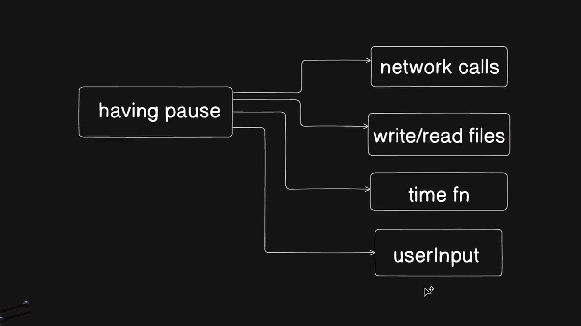
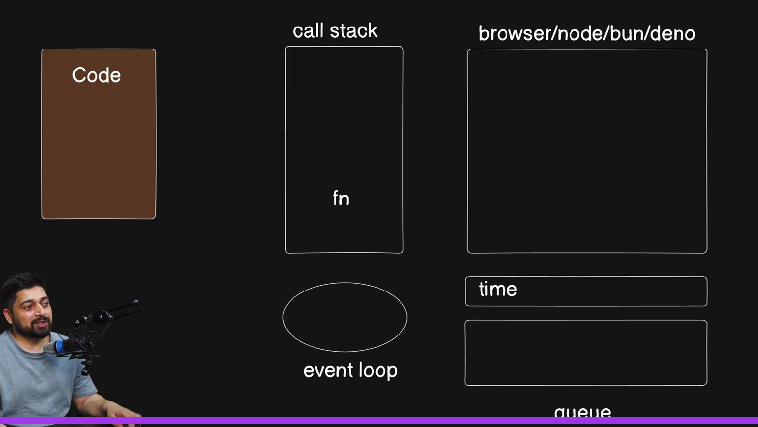

# Async JavaScript

Async means something functionality pause in our code. Java-script doesn't have this.

* sometimes we need to fetch some data or read and write and time related function, They are time-consuming part of a
  code. java-script don't have any time to stop and perform these task.

> Java-script have asynchronous behaviour. it executes all the code that are not time-consuming, after that it runs all
> the time-consuming code
> 

---------------

**Java-Script have no power to network call and time functions. In our machine its provides by node-js.**

## EVENT LOOP

> 