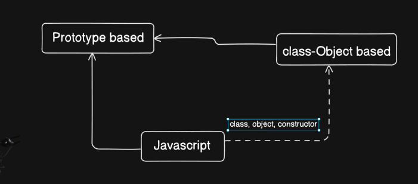
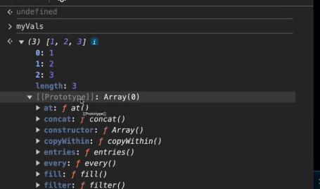
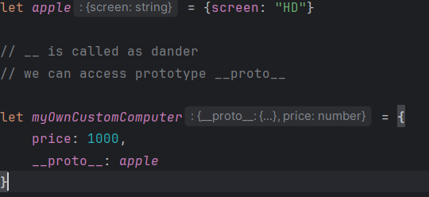
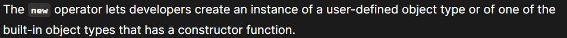
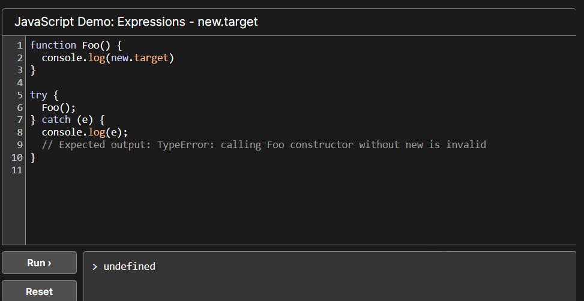
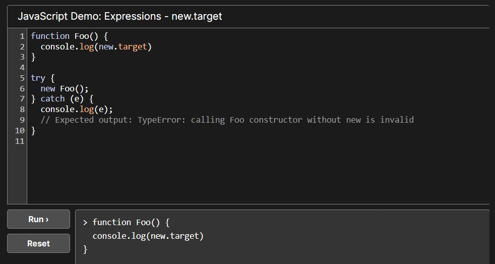

# Object-Oriented In Java-script

**Object-oriented programming** main purpose is to deal with real-world problems using programming languages. It is also
called as **OOP**.

* Java - script is not fully object-oriented programing language. It just supports some properties of oops, like
  class,object, and constructor and more.
* Main confusing things is that all the class and objects later converted on prototype based.
* **It is a prototype-base object-oriented language.**



### Prototype

In javaScript almost everywhere we can see prototype properties.
Prototype is extra features or functionality, in any given data type.


> `__` is called as dander.
> we can access prototypes of any data type using this dander like this `obj.__proto__`

### Copy protoType one to another object.

we can copy any object properties using __proto__.

example:


⚠️ we can't access default properties using protoType. if we print it then it will show undefined. But if we override
any then we can access it by override object.


We have two method to set and get prototype.

--------

### Creating objects using function Constructor.

**Function Constructor** creates a **_function object_**. If it called directly, it just creates function dynamically.

* It suffers with security issues.
* Function name should be starts with uppercase.

```javascript
const sum = Function('a', 'b', 'return a + b');
console.log(sum);
```

> function anonymous(a,b
) {
> return a + b
> }

### new



1. [🐒] Properties/objects added to the constructor function's prototype property are therefore accessible to all
   instances created from the constructor function.

**Example:**
> `Tea.prototype.price = 100`
> we are just adding new properties in the functions object

> A function can know whether it is invoked with new by checking **_new.target_**. new.target is only undefined when the
> function is invoked without new. For example, you can have a function that behaves differently when it's called versus
> when it's constructed:

**Example:**


When a function get called using new function `new.target` returns a reference of the constructor or function.
