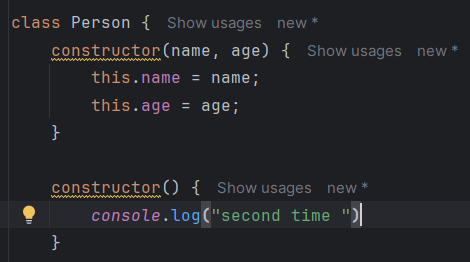
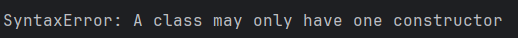
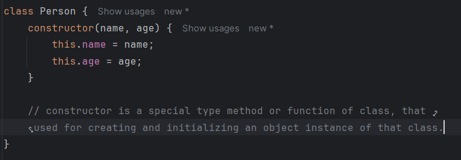
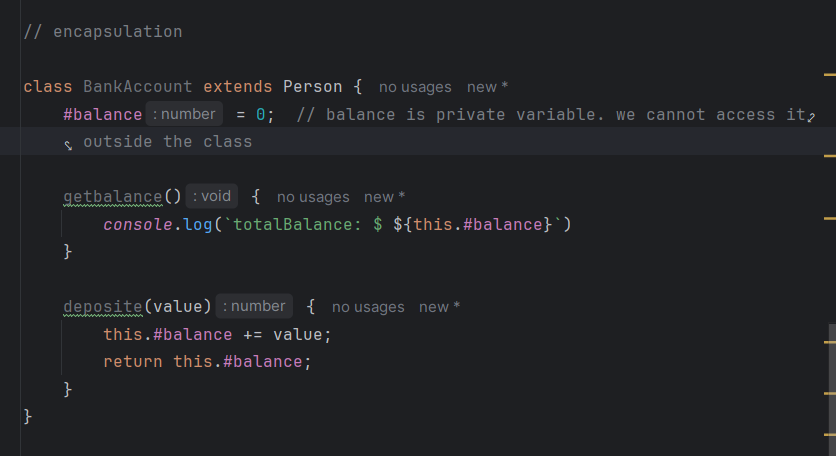

# OOP

### class

Classes are a template for creating objects. They encapsulate data with code to work on that data.

* A class cannot have multiple `constructor` in java-script.
* 
    * 

#### constructor:

Mentioned on the image.

* In the class we don't need to mention any function with the `function` keyword. Java-script automatically handel it.

------

## Encapsulation:

Encapsulation is the process of binding methods and data in a single unit.
> Example:
> Capsule.

we can create private variable or method using `#` operator.

----------

## Static

Static keyword defines a static method or field. Static properties cannot be directly accessed on instances of the
class.
Instead, they're accessed on the class itself.

## Operators

> The instanceof operator tests to see if the prototype property of a constructor appears anywhere in the prototype
> chain of an object. it is return the result as boolean true and false